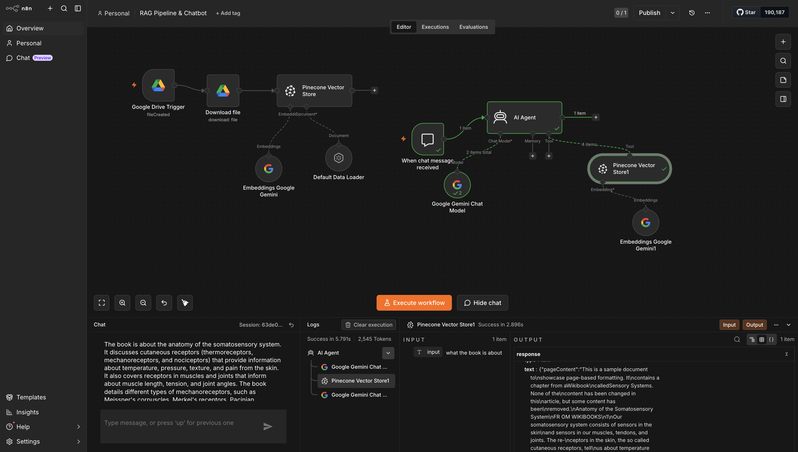

# RAG Pipeline & Chatbot

A self-hosted n8n workflow that turns any document into an AI assistant you can ask questions about. Drop a PDF into a Google Drive folder and it is automatically parsed, chunked, embedded with Google Gemini, and stored in a Pinecone vector database. A chat agent then answers questions grounded in that document — no hallucination, no generic guessing.

Built entirely on Google/Gemini (no OpenAI) and self-hosted to run with no execution limits.

## Preview



## How this was built

Built end-to-end in self-hosted n8n (v2.22.5), running locally to avoid the cloud execution caps. The course reference implementation used OpenAI for embeddings and chat; this build swaps that out entirely for **Google Gemini** to keep it free and provider-consistent.

The work was not "drop in nodes and done" — getting it stable meant debugging three real issues (see [Engineering challenges solved](#engineering-challenges-solved)): a `pdf-parse` dependency conflict, embedding-dimension matching, and Gemini's tool-calling behaviour inside the AI Agent.

Full build notes:

- [`docs/architecture.md`](docs/architecture.md) — system flow, runtime decisions, security posture, and hardening backlog.
- [`docs/workflow.md`](docs/workflow.md) — build phases, debugging log, setup checklist, and verification notes.
- [`CHANGELOG.md`](CHANGELOG.md) — iteration history for the repository.

## What it does

Two pipelines share a single Pinecone index:

**Ingestion (write path)**
1. A Google Drive trigger watches a folder for new files.
2. The new PDF is downloaded.
3. A document loader extracts and splits the text into chunks.
4. Each chunk is embedded with Gemini and upserted into Pinecone under a named namespace.

**Retrieval (read path)**
1. A chat trigger receives a user question.
2. An AI Agent (Gemini chat model) decides to call the Pinecone retriever tool.
3. Relevant chunks are pulled from the same index and passed back as context.
4. The agent answers strictly from the retrieved content.

## Why this stack

- **n8n (self-hosted)** — visual workflow automation with native LangChain nodes. Self-hosting removes the cloud execution limit so the pipeline can run freely.
- **Google Gemini** — `gemini-embedding-001` for embeddings and `gemini-2.5-flash-lite` for the chat model. Chosen over OpenAI to run on a single free Google API key.
- **Pinecone** — managed vector database (dense index, cosine similarity) for fast semantic retrieval.

## Architecture

```
INGEST   Google Drive Trigger → Download File → Default Data Loader
                                       │
                          Embeddings (Gemini) → Pinecone (insert)

RETRIEVE  Chat Trigger → AI Agent ── Chat Model (Gemini 2.5 Flash Lite)
                              └────── Tool: Pinecone (retrieve) ── Embeddings (Gemini)
```

The two pipelines never connect on the canvas — they are linked through the shared Pinecone index (`n8n-gemini`, namespace `Book`). One writes vectors, the other reads them.

See [`docs/architecture.md`](docs/architecture.md) for the reviewer-facing architecture writeup.

## Engineering challenges solved

These are the problems that turned a tutorial into real debugging:

1. **`pdf-parse` v1 vs v2 dependency conflict.** n8n v2.22.5 ships `pdf-parse@2`, but the LangChain document loader only supports v1, so PDF parsing failed on every run. Fixed by installing n8n in a dedicated project folder with `pdf-parse@^1` pinned and an npm `overrides` rule (`"pdf-parse": "$pdf-parse"`) to force every nested copy down to v1.

2. **Embedding-dimension matching.** The Pinecone index dimension has to exactly match the embedding model's output, or upserts are rejected. Aligned the index to the Gemini embedding output and confirmed by checking the stored record count in Pinecone.

3. **Gemini tool-calling inside the AI Agent.** Two distinct quirks: (a) an intermittent "tool input did not match expected schema" error specific to Gemini's function-calling format, and (b) the agent occasionally answering without calling the retriever at all. Mitigated the second with a strict system prompt that forces a tool call on every question and forbids answering from the model's own knowledge.

## Security posture

- **No secrets in this repository.** The exported workflow contains only n8n credential *references* (internal IDs), never API keys. All real keys — Gemini, Pinecone, Google OAuth — live in the local n8n credential store, not in the JSON.
- The committed workflow is a **sanitized template**: credential IDs, Google Drive folder/file IDs, webhook IDs, and instance metadata are replaced with placeholders.
- The Google Drive connection was authorised against a dedicated, empty test account — never a personal account holding real files.

## Local setup

1. Run n8n locally (Node 18+):
   ```bash
   npx n8n
   ```
   Open `http://localhost:5678`.
2. Import the workflow: **Workflows → Import from File →** `workflow/rag-pipeline-chatbot.json`.
3. Create your own credentials and map them to the imported nodes:
   - Google Drive (OAuth2)
   - Google Gemini (PaLM) API key
   - Pinecone API key
4. Create a Pinecone index named `n8n-gemini` (dense, cosine) and point the nodes at it.
5. Update the Google Drive trigger to watch your own folder, then drop a PDF in to ingest it.

## Verification

Confirmed working end-to-end: a test PDF placed in the watched folder was ingested into Pinecone, and the chat agent answered questions using only the retrieved content. A successful run shows the Pinecone retrieval tool firing in the execution log and an answer drawn directly from the source document.

Because this repository exports an n8n workflow rather than an application codebase, verification is import-and-run based instead of `npm test` based. The committed JSON is validated as parseable JSON, and the runtime test is documented in [`docs/workflow.md`](docs/workflow.md).

## Use cases

The PDF here is a placeholder — point the same pipeline at real documents and it becomes a product:

- **Customer support bot** — answer questions from a company's help docs, 24/7, without hallucinating.
- **Internal knowledge bot** — let employees query handbooks, policies, and SOPs in plain language.
- **Sales enablement** — surface product specs and competitive details on demand.
