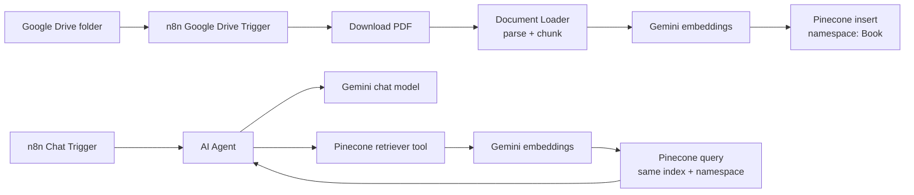

# Architecture

RAG Pipeline & Chatbot is a self-hosted n8n workflow that turns uploaded PDFs into a queryable knowledge base. It uses Google Drive for document intake, Gemini for embeddings and chat, and Pinecone as the vector store.

## Runtime Flow

1. A PDF is added to the watched Google Drive folder.
2. n8n downloads the file and passes it to the LangChain document loader.
3. The loader extracts text and chunks it for retrieval.
4. Gemini creates embeddings for each chunk.
5. Pinecone stores the vectors in the configured index and namespace.
6. A user asks a question through the n8n chat trigger.
7. The AI Agent calls the Pinecone retriever tool, receives relevant chunks, and answers only from retrieved content.

## Core Decisions

### Self-hosted n8n

The workflow runs in a local/self-hosted n8n instance to avoid hosted workflow execution caps and to keep credentials in the local n8n credential store.

### Gemini-only model stack

The workflow uses Gemini for both embeddings and chat instead of mixing model providers. This keeps setup simpler for a reviewer: one Google AI credential activates both the embedding node and chat model node.

### Pinecone namespace isolation

The ingestion and retrieval paths share the same Pinecone index and namespace. This is what links the two disconnected n8n canvas paths: ingestion writes into `Book`; retrieval queries from `Book`.

### Strict retrieval behavior

The AI Agent system prompt requires the retriever tool to be called for every user question. The product goal is grounded document Q&A, not general chat.

## Security Posture

- The committed workflow is a template. Credential IDs are placeholders and no API keys are committed.
- Google Drive folder IDs, file IDs, webhook IDs, workflow IDs, and instance metadata are removed from the workflow export.
- Real Gemini, Pinecone, and Google OAuth credentials must be created in the reviewer's own n8n instance.
- Use a test Google Drive account or a folder containing non-sensitive files when validating the workflow.

## Production Hardening Backlog

- Add a documented evaluation set with sample questions, expected supporting passages, and acceptable answers.
- Add retrieval settings notes: chunk size, overlap, top-k, similarity threshold, and embedding dimension.
- Add multi-document metadata filters so answers can be scoped by file, folder, version, or tenant.
- Add ingestion deduplication to avoid re-embedding the same file repeatedly.
- Add a failure-handling path for unsupported PDFs, empty extraction results, Pinecone upsert errors, and Gemini API errors.
- Add cost controls for Gemini calls and Pinecone writes before running on large folders.
- Add a private deployment guide if the workflow is moved from local n8n to a hosted n8n instance.
